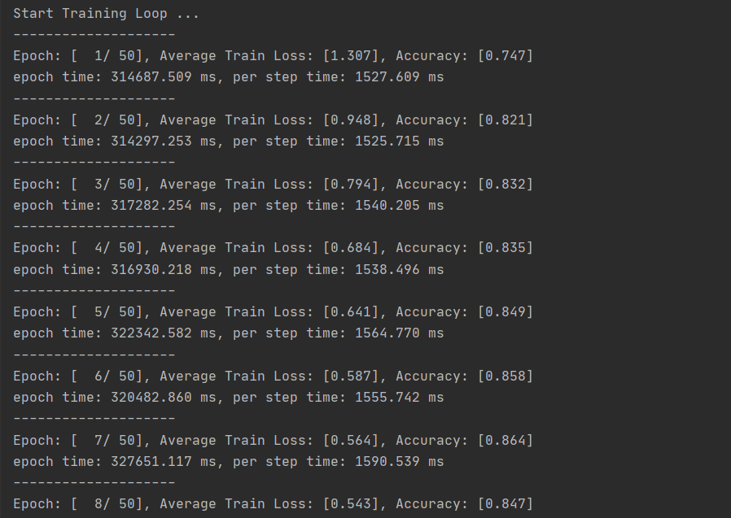
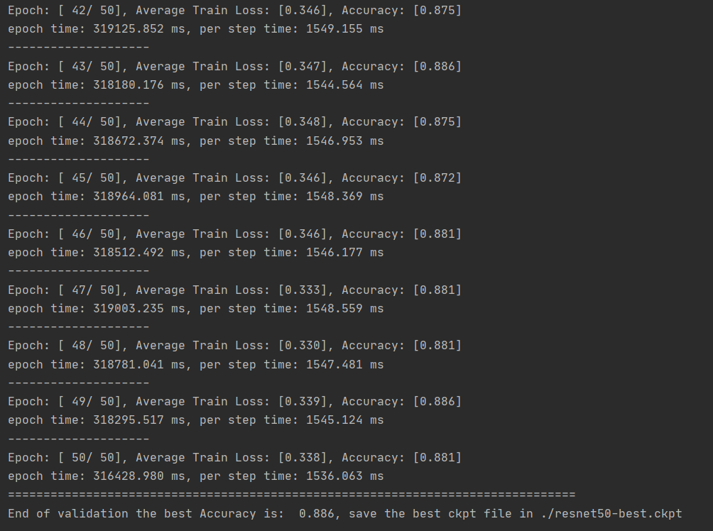
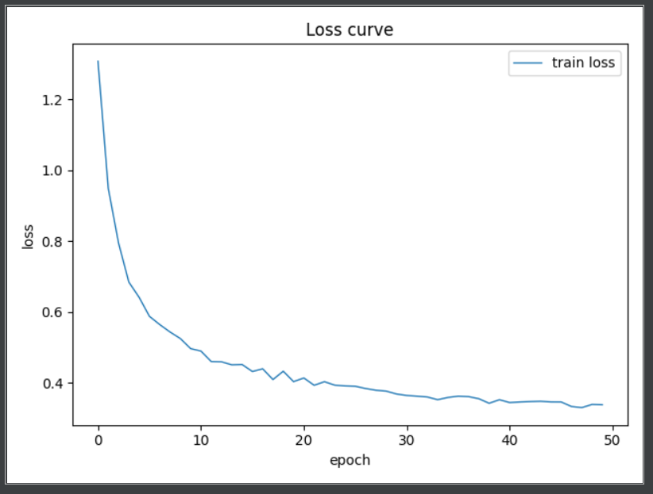
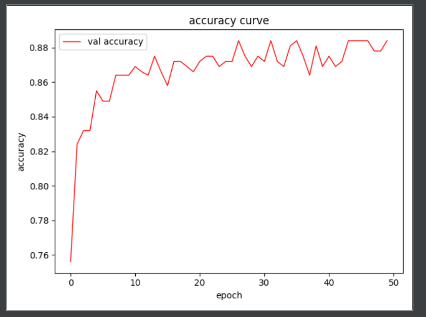
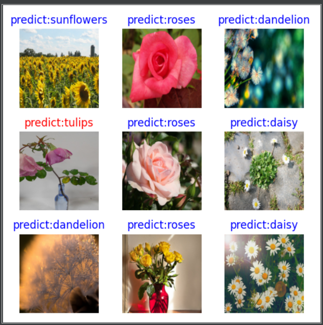

# MindSpore 框架下基于ResNet50迁移学习的方法实现花卉数据集图像分类（5类）


### 1.  文件结构:

```  
  ├──TEST
  	├── dataset -- 数据集
  		├──flower_data -- 花卉数据集
  			├──flower_photos -- 下载全部数据集
  				├──daisy
  				├──dandelion
  				├──roses
  				├──sunflowers
  				└──tulips
  			├──train -- 训练集
  				├──daisy
  				├──dandelion
  				├──roses
  				├──sunflowers
  				└──tulips
  			├──val -- 验证集
  				├──daisy
  				├──dandelion
  				├──roses
  				├──sunflowers
  				└──tulips
  		└──split_data.py -- 训练集与测试集划分脚本
  	
  	├── picture -- 实验截图
  		├── loss.png -- 训练过程loss变化图
  		├── accuracy.png -- 训练过程accuracy变化图
  		├── predict.png -- 随机预测图
  		├── train1.png -- 训练截图
  		├── train2.png -- 训练截图
  		└── 运行图.txt -- 完整的运行复制成文本记录
 	├── model.py -- ResNet模型搭建
 	├── predict.py -- 预测脚本
	├── resnet50_pre.ckpt  -- resnet50预训练模型
	├── resnet50_best.ckpt -- resnet50适配花卉分类的最高精度模型
	└── train.py -- 训练脚本
```


### 2.  所需环境

- **python 3.9**
- **pycharm (IDE)**

- **mindspore 2.2.10  -- Windows-x64**


### 3.  运行方式

1. **先运行train.py文件，训练模型**

   ```
   python train.py
   ```

   

2. **再运行predict.py文件，验证模型**

   ```python
   # 验证模型
   python predict.py
   ```

   

### 4.  数据集简介

**1.自建数据文件夹**

首先确定这次分类种类，采用爬虫、官网数据集和自己拍照的照片获取5类，新建个文件夹data，里面包含5个文件夹，文件夹名字取种类英文，每个文件夹照片数量最好一样多，五百多张以上。如我选了雏菊，蒲公英，玫瑰，向日葵，郁金香5类，如下图，每种类型有600~900张图像。

**2.划分训练集与测试集**

使用split_data.py进行数据集分类，划分为训练集和数据集


### 5. model.py——构建ResNet50网络模型

使用ResNet50预训练模型进行微调。调用resnet50构造ResNet50模型，利用ResNet50预训练模型，并加载预训练模型中的参数到网络中

```python
def _resnet(block: Type[Union[ResidualBlockBase, ResidualBlock]],
            layers: List[int], num_classes: int, pretrained: bool, pretrianed_ckpt: str,
            input_channel: int):
    model = ResNet(block, layers, num_classes, input_channel)

    if pretrained:
        # 加载预训练模型
        param_dict = load_checkpoint(pretrianed_ckpt)
        load_param_into_net(model, param_dict)

    return model


def resnet50(num_classes: int = 1000, pretrained: bool = False):
    "ResNet50模型"
    resnet50_ckpt = "./resnet50_pre.ckpt"
    return _resnet(ResidualBlock, [3, 4, 6, 3], num_classes,
                   pretrained, resnet50_ckpt, 2048)
```


### 6. train.py——训练，计算损失值loss，计算accuracy，保存训练好的网络参数

**本次训练采用CPU进行训练50次（有条件的可以进行多次训练），收集每次的loss和accuracy，绘制最终图像。**

- **训练截图：**

  

  ......

  


- **损失loss：**

  


- **准确度accuracy:**

  


**保留训练好的网络权重写到resnet50_best.ckpt文件中**


### 7. predict.py——利用训练好的网络参数后，随机抽取图像进行分类测试

随机选取9张照片进行判断，错误标红，成功标蓝

- 某次随机预测结果：

  


